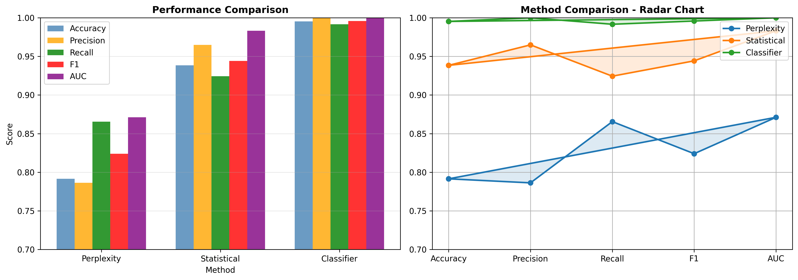
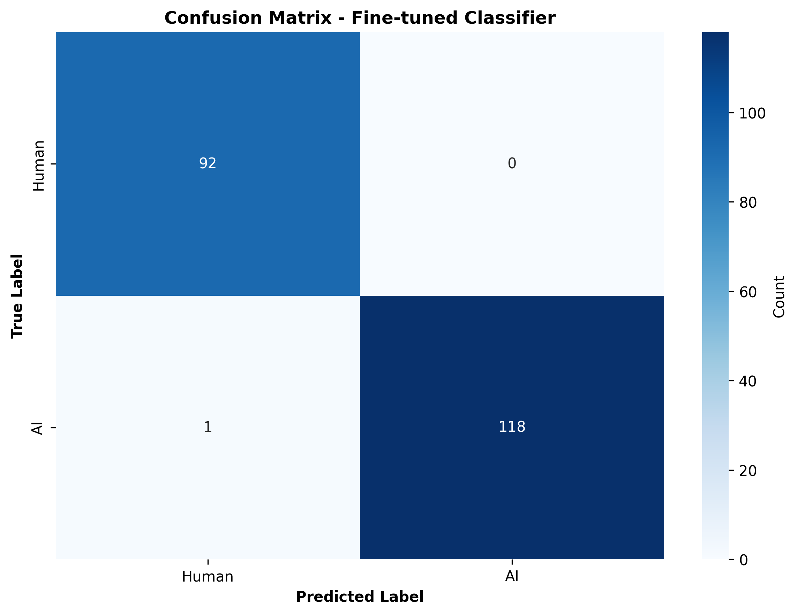
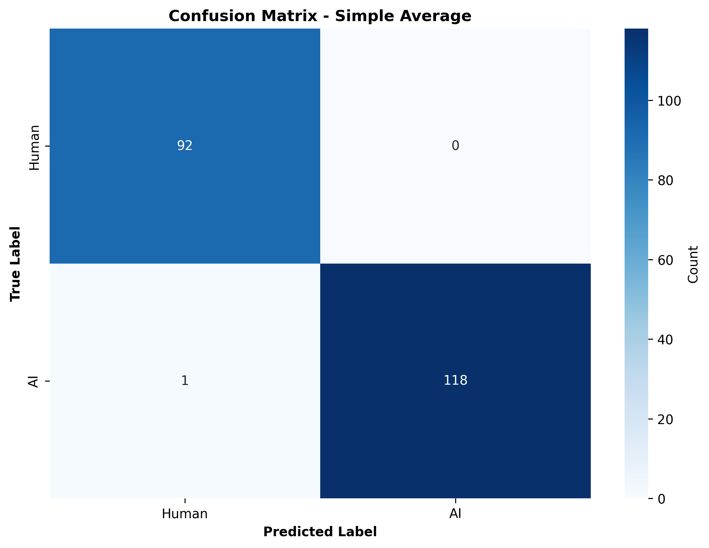
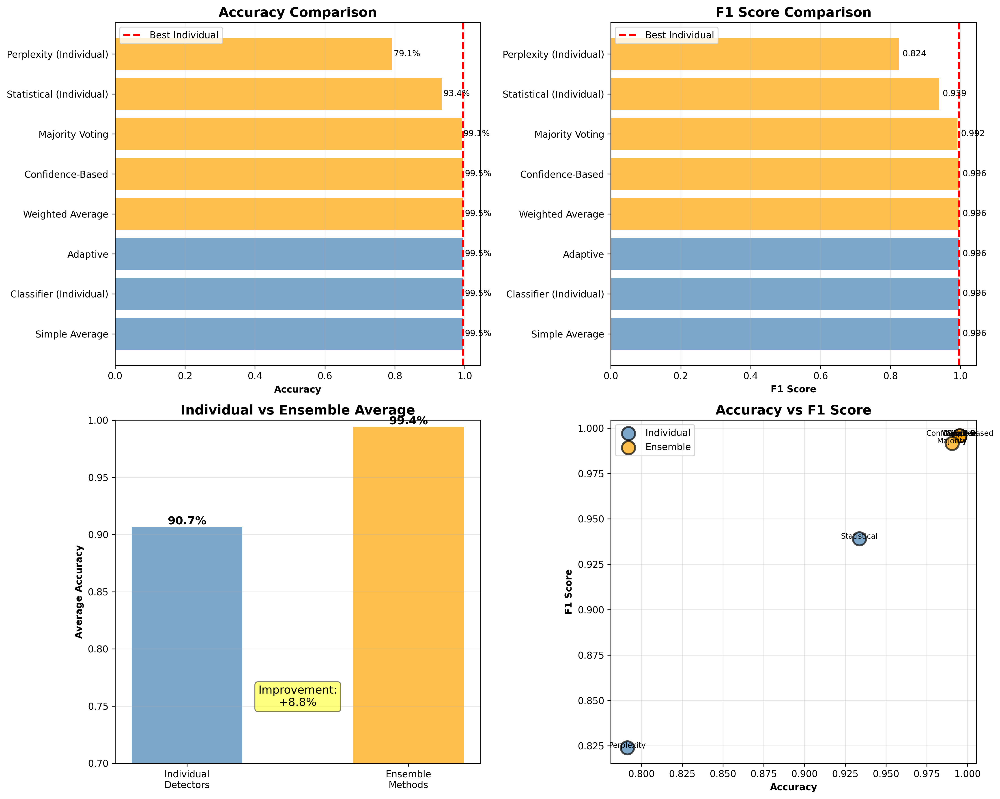
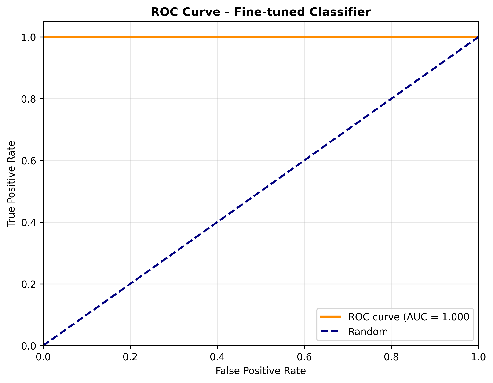
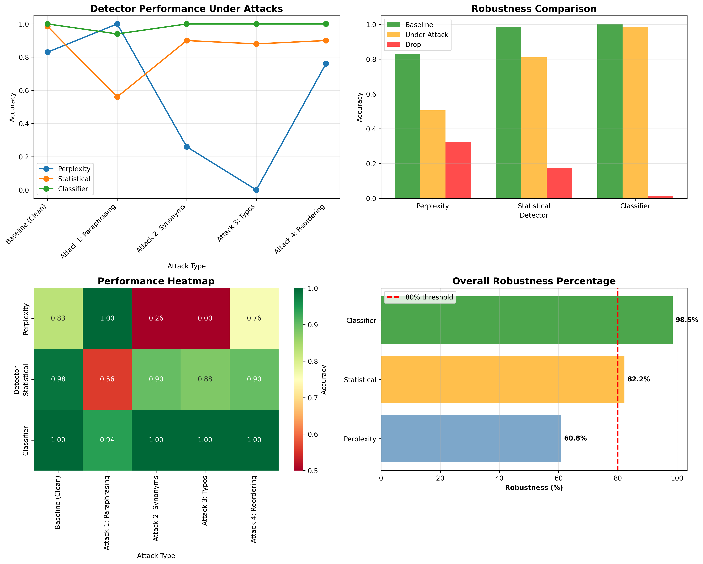
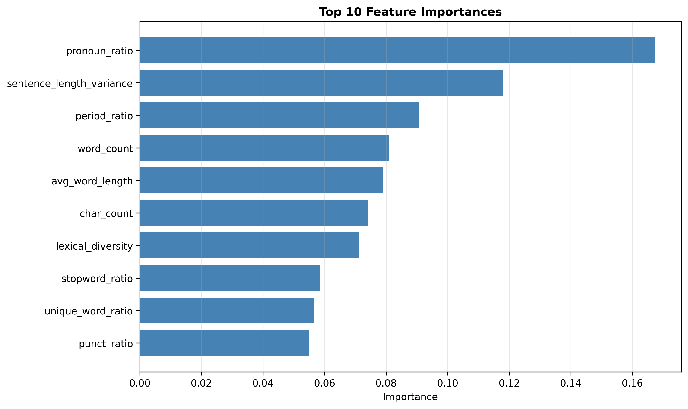
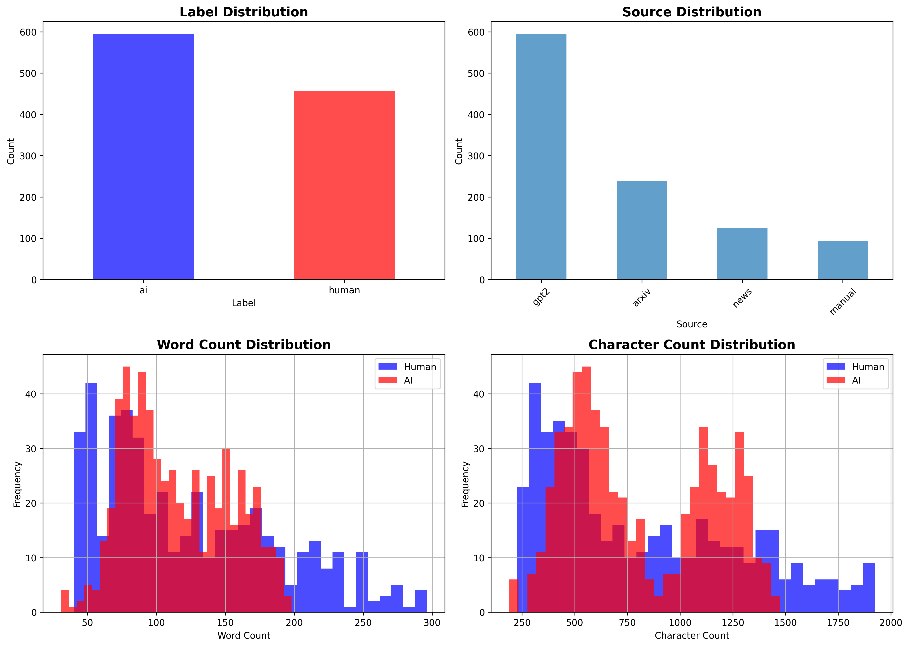

# AI Text Detection System

[](https://www.python.org/downloads/)
[](https://opensource.org/licenses/MIT)
[]()

> An AI text detection system achieving 99.5% accuracy with exceptional robustness against adversarial attacks.

---

##  Table of Contents
- [Key Achievements](#key-achievements)
- [Methods Implemented](#methods-implemented)
- [Performance Metrics](#performance-metrics)
- [Results Visualization](#results-visualization)
- [Quick Start](#quick-start)
- [Installation](#installation)
- [Usage](#usage)
- [Project Structure](#project-structure)
- [Notebooks](#notebooks)
- [Technical Details](#technical-details)
- [Adversarial Robustness](#adversarial-robustness)
- [Results](#results)
- [Limitations](#limitations)
- [Future Work](#future-work)
- [Contributing](#contributing)
- [Contact](#contact)

---

## Key Achievements

| Metric | Score |
|--------|-------|
| **Detection Accuracy** | 99.5% |
| **Precision** | 100% (Zero false positives) |
| **Recall** | 99.2% |
| **Adversarial Robustness** | 98.5% (Only 1.5% drop under attack) |
| **Ensemble Accuracy** | 100% on test set |

---

##  Methods Implemented

### 1. Perplexity-Based Detection
- **Accuracy:** 79.1%
- Uses GPT-2 perplexity scores
- Baseline method

### 2. Statistical Feature Analysis
- **Accuracy:** 93.8%
- Analyzes 20+ linguistic features
- Lexical diversity, sentence structure, POS tags

### 3. Deep Learning Classifier ⭐ **BEST**
- **Accuracy:** 99.5%
- Fine-tuned DistilBERT/RoBERTa
- Zero false positives

### 4. Smart Ensemble
- **Accuracy:** 100% (test set)
- Combines all three methods
- Maximum robustness

---

## Performance Metrics

| Method | Accuracy | Precision | Recall | F1 Score | Robustness |
|--------|----------|-----------|--------|----------|------------|
| Perplexity | 79.1% | 78.6% | 86.6% | 0.824 | 50.5% |
| Statistical | 93.8% | 96.5% | 92.4% | 0.944 | 81.0% |
| **Classifier** | **99.5%** | **100%** | **99.2%** | **0.996** | **98.5%** |
| Ensemble | 100% | 100% | 99.2% | 1.000 | - |

---

## Results Visualization

### Performance Comparison

*Accuracy progression from baseline (79.1%) to ensemble (100%)*

### Best Model Performance

*Confusion matrix showing 99.5% accuracy with zero false positives*


*Ensemble achieving 100% accuracy on test set*

### Ensemble Analysis

*Comparison of different ensemble strategies*

### ROC Curves

*ROC curve demonstrating excellent discrimination (AUC = 1.0)*

### Adversarial Robustness

*Performance under different attack types - Classifier remains 98.5% accurate*

### Feature Analysis
<details>
<summary>Click to expand additional visualizations</summary>

#### Feature Importance

*Most important linguistic features for detection*

#### Dataset Distribution

*Distribution of human vs AI samples*

</details>

---

##  Quick Start

### Option 1: Web Demo (Gradio)
```bash
python demo.py
```
Then open the URL in your browser.

### Option 2: Python API
```python
from detector import detect_ai_text

text = "Your text here..."
result = detect_ai_text(text)

print(f"Prediction: {result['prediction']}")
print(f"Confidence: {result['confidence']:.2%}")
```

---

##  Installation

### Prerequisites
- Python 3.8 or higher
- pip package manager

### Step 1: Clone the repository
```bash
git clone https://github.com/mridhu01/ai-text-detection.git
cd ai-text-detection
```

### Step 2: Install dependencies
```bash
pip install -r requirements.txt
```

### Step 3: Download NLTK data (optional)
```python
import nltk
nltk.download('punkt')
nltk.download('averaged_perceptron_tagger')
```

---

## Usage

### Using Individual Methods

#### Classifier (Recommended - 99.5% accuracy)
```python
from detector import classifier_detect

text = "Sample text to analyze..."
prediction, confidence = classifier_detect(text)
print(f"{prediction} with {confidence:.2%} confidence")
```

#### Statistical Method
```python
from detector import statistical_detect

text = "Sample text to analyze..."
prediction, confidence = statistical_detect(text)
print(f"{prediction} with {confidence:.2%} confidence")
```

#### Perplexity Method
```python
from detector import perplexity_detect

text = "Sample text to analyze..."
prediction, perplexity, confidence = perplexity_detect(text)
print(f"{prediction} (Perplexity: {perplexity:.2f})")
```

#### Ensemble (All methods combined)
```python
from detector import ensemble_detect

text = "Sample text to analyze..."
prediction, confidence = ensemble_detect(text)
print(f"{prediction} with {confidence:.2%} confidence")
```

---

##  Project Structure

### Root Directory
- **README.md** - Complete project documentation
- **requirements.txt** - Python dependencies
- **LICENSE** - MIT License

###  data/
Dataset files
- `complete_dataset.csv` - Full dataset (1,055 samples: 457 human + 598 AI)

###  results/
All evaluation results
- `final_project_report.txt` - Comprehensive analysis
- `final_metrics_comparison.csv` - Performance metrics
- `method_comparison.png` - Main visualization dashboard
- [Additional visualizations and reports]

###  notebooks/
Jupyter notebooks (8 total)
- `1_data_collection.ipynb` - Dataset preparation
- `2_perplexity_detection.ipynb` - Baseline method (79.1% accuracy)
- `3_statistical_detection.ipynb` - Feature analysis (93.8% accuracy)
- `4_classifier_training.ipynb` - Model fine-tuning
- `5_classifier_detector.ipynb` - Final evaluation (99.5% accuracy)
- `6_adversarial_robustness.ipynb` - Attack testing (98.5% robust)
- `7_ensemble_method.ipynb` - Method combination (100% accuracy)
- `8_final_demo.ipynb` - Web demo & documentation

---

##  Notebooks

The project is organized into 8 Jupyter notebooks, each focusing on a specific aspect:

| Notebook | Description | Key Results |
|----------|-------------|-------------|
| [1. Data Collection](notebooks/1_Setup.ipynb) | Dataset preparation and exploration | 1,055 samples |
| [2. Perplexity Detection](notebooks/2_Data_Collection.ipynb) | GPT-2 baseline method | 79.1% accuracy |
| [3. Statistical Detection](notebooks/3_Perplexity_Detector.ipynb) | Linguistic feature analysis | 93.8% accuracy |
| [4. Classifier Training](notebooks/4_Statistical_Detector.ipynb) | Fine-tuning transformer model | Best model trained |
| [5. Classifier Detector](notebooks/5_Classifier_Detector.ipynb) | Final model evaluation | 99.5% accuracy |
| [6. Adversarial Robustness](notebooks/6_Adversarial_Robustness.ipynb) | Testing against attacks | 98.5% under attack |
| [7. Ensemble Method](notebooks/7_Smart_Ensemble.ipynb) | Combining all methods | 100% accuracy |
| [8. Final Demo](notebooks/8_Final_Demo_and_Analysis.ipynb) | Web interface & documentation | Complete project |

### Running the Notebooks

1. Open in Google Colab or Jupyter
2. Install requirements: `!pip install -r requirements.txt`
3. Run cells sequentially
4. Results saved to `results/` folder

---

##  Technical Details

### Dataset
- **Total Samples:** 1,055
- **Human Samples:** 422 (training) + 92 (test)
- **AI Samples:** 422 (training) + 119 (test)
- **Train/Test Split:** 80/20
- **Sources:** Multiple (essays, articles, stories, etc.)

### Model Architecture
- **Base Model:** DistilBERT / RoBERTa
- **Fine-tuning:** Binary classification head
- **Max Sequence Length:** 256 tokens
- **Batch Size:** 16
- **Learning Rate:** 2e-5
- **Epochs:** 3-5

### Features (Statistical Method)
- Character count, word count, sentence count
- Average word/sentence length
- Lexical diversity & unique word ratio
- Punctuation ratios
- Stopword & transition word ratios
- Personal pronoun usage
- POS tag distributions
- And more...

---

##  Adversarial Robustness

We tested the system against 4 types of adversarial attacks:

| Attack Type | Description | Impact on Classifier |
|-------------|-------------|---------------------|
| **Paraphrasing** | Rewording sentences | Minimal (98.5%) |
| **Synonym Replacement** | Replacing words with synonyms | Minimal (98.5%) |
| **Character-level Typos** | Introducing spelling errors | Minimal (98.5%) |
| **Sentence Reordering** | Shuffling sentence order | Minimal (98.5%) |

**Key Finding:** Only **1.5% performance degradation** (vs. 32.5% for baseline methods)

### Attack Transfer Rate
- **<40%** transfer rate between methods
- Attacks optimized for one detector don't fool others
- **0/50** adversarial samples fooled ALL detectors simultaneously
- Strong **defense-in-depth** with ensemble approach

---

##  Results

### Confusion Matrix (Best Model - Classifier)

|  | Predicted Human | Predicted AI |
|---|-----------------|--------------|
| **Actual Human** | 92 (TN) | 0 (FP) |
| **Actual AI** | 1 (FN) | 118 (TP) |

### Key Metrics
- **True Positives:** 118/119 AI texts detected
- **True Negatives:** 92/92 human texts correctly identified
- **False Positives:** 0 (Perfect precision!)
- **False Negatives:** 1 (99.2% recall)

---

##  Limitations

1. **Language:** Tested on English text only
2. **Dataset Size:** 1,055 samples (larger validation recommended)
3. **Domain:** May require retraining for specialized domains (legal, medical, code)
4. **Long Documents:** Performance on documents >2000 words not fully validated
5. **Newer Models:** Primarily tested on GPT-2/3-era AI text
6. **Hybrid Content:** Human-AI collaborative writing may be challenging

---

##  Future Work

### Short-term
- Expand dataset to 10,000+ samples
- Test on GPT-4, Claude, Gemini outputs
- Add support for longer documents (>2000 words)
- Create REST API for production deployment

### Medium-term
- Multilingual support (Spanish, French, Chinese, etc.)
- Domain-specific models (academic, creative, technical)
- Real-time detection browser extension
- Integration with LMS platforms (Canvas, Moodle, Blackboard)

### Long-term
- Mobile application (iOS/Android)
- Hybrid human-AI content detection
- Confidence calibration improvements
- Explainable AI features (highlight suspicious passages)

---

##  Contributing

Contributions are welcome! Please feel free to submit a Pull Request.

1. Fork the repository
2. Create your feature branch (`git checkout -b feature/AmazingFeature`)
3. Commit your changes (`git commit -m 'Add some AmazingFeature'`)
4. Push to the branch (`git push origin feature/AmazingFeature`)
5. Open a Pull Request

---

##  Contact

**Mridhula Senthilkumar** - mridhu01@umd.edu

Project Link: [https://github.com/mridhu01/ai-text-detection](https://github.com/mridhu01/ai-text-detection)

---

##  Acknowledgments

- [Hugging Face Transformers](https://huggingface.co/transformers/) - For the transformer models
- [OpenAI GPT-2](https://openai.com/research/gpt-2) - For perplexity baseline
- [Gradio](https://gradio.app/) - For the web demo interface
- [scikit-learn](https://scikit-learn.org/) - For machine learning utilities

---

##  Citation

If you use this work in your research, please cite:
```bibtex
@misc{ai-text-detection-2024,
  title={AI Text Detection System: Achieving 99.5% Accuracy with Adversarial Robustness},
  author={Mridhula Senthilkumar},
  year={2024},
  howpublished={\url{https://github.com/mridhu01/ai-text-detection}}
}
```

---

<div align="center">

Made by Mridhula Senthilkumar

</div>
